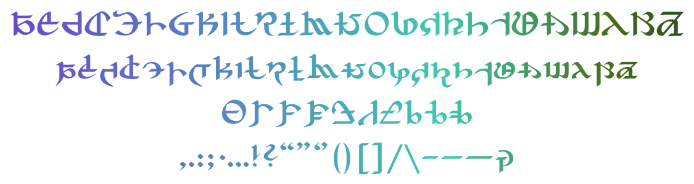

# Augmented Postulated Proto-Alphabet

[中文介绍](README_CN.md)

**Fanmade** typeface, greetings from the World Unsundered.

A re-work of the Postulated Proto-Alphabet with extended language support and Opentype features.

## Glyphs Preview

Currently supports (the same as [my Eorzean font](https://github.com/karaipsum/Eorzean-Typeface)):
- Basic Latin alphabets (A-Z, a-z)
- Diacritics latin alphabets (🇫🇷, 🇩🇪 and more!)
- Numbers (0-9)
- Basic punctuations and symbols
- and more (…?)

## Kerning Preview

> _The World Unsundered_

Manually adjusted kerning pairs for improved readability. Toggle "Metrics" setting in your preferred design software to apply.

I've adjusted the kerning to a looser fit, compared to [my Eorzean font](https://github.com/karaipsum/Eorzean-Typeface).

## Opentype Features Support (default off)

Below are currently supported Opentype features. They are based on my personal idea and interpretation, which I haven't noticed in official arkworks so far. They are **off** by default. You may turn it on for fun.

### Discretionary Ligature `dlig`

> **Fa**ndaniel
>
> _The Gates of Pand**ae**monium_

### Swash `swsh`

> _Peripeteia K**ry**stalline_

### Old-style Figures `onum`

> _**0123456789**_

## Source

- Postulated Proto-Alphabet from [_Encyclopaedia Eorzea III_](https://sqex.to/Snrq9)
- [Glyph reference table](https://weibo.com/3506214112/NkPbor2Iz) by [Celes](https://club.huijiwiki.com/wiki/%E7%89%B9%E6%AE%8A:%E9%A9%BE%E9%A9%B6%E5%AE%A4#/user/45979/main)（[@时与悠可](https://weibo.com/u/3506214112)）

## License

All company, product, and system names mentioned herein are trademarks or registered trademarks of their respective companies.

Augmented Postulated Proto-Alphabet is licensed under the [MIT](LICENSE) License.

## Footnote

Feel free to post suggestions and/or any issues here.